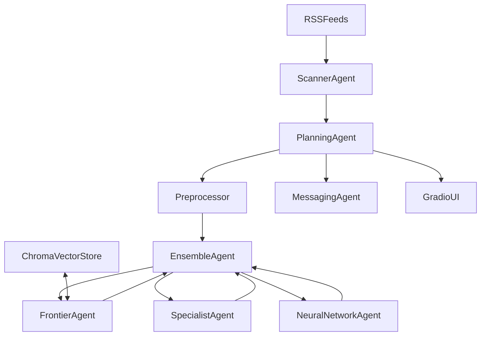

# Deal Hunter

Deal Hunter is a week8-inspired multi-agent pricing project for finding high-value electronics deals.  
This repository is in active buildout: notebook prototypes are being migrated into production-quality modules under `src/deal_hunter`.

## Current Status

Implemented now:
- `Item` data model + Hugging Face dataset loading in `src/deal_hunter/agents/items.py`
- Modal fine-tuned pricing service (`Pricer`) in `src/deal_hunter/services/pricer.py`
- LiteLLM-based product preprocessor in `src/deal_hunter/services/preprocessing.py`
- Evaluation utilities (`Tester`, `evaluate`) in `src/deal_hunter/services/testing.py`
- Exploration notebooks in `notebooks/`

Planned next (from `.cursor/plans/buildfromweek8.plan.md`):
- Centralized config (`pydantic-settings`)
- Pure Pydantic deal models
- RSS scraping service, vector store service, notification service
- Agent suite (`Scanner`, `Frontier`, `Specialist`, `NeuralNetwork`, `Ensemble`, `Messaging`, `Planning`)
- End-to-end `main.py` orchestration and Gradio dashboard
- Test suite and exploration notebook polish

## Target Architecture



Note: several boxes above are planned and not implemented in `src/` yet.

## Repository Layout

- `src/deal_hunter/` - package code (services, agents, models, ui, nn)
- `notebooks/` - prototype and benchmarking notebooks
- `error_docs/errors.md` - troubleshooting notes and major build fixes
- `.cursor/plans/buildfromweek8.plan.md` - phase-by-phase implementation plan

## Prerequisites

- Python 3.11+ (project currently uses 3.12)
- `uv` package manager
- Accounts/tokens for:
  - Hugging Face (`HF_TOKEN`)
  - OpenAI-compatible provider key (`OPENAI_API_KEY`) for frontier notebook cells
  - Modal authentication for remote specialist pricing

## Quickstart

### 1) Install dependencies

```bash
uv sync
```

### 2) Configure environment

Create a `.env` in repo root with at least:

```bash
HF_TOKEN=your_huggingface_token
OPENAI_API_KEY=your_openai_key
```

Optional (for notifications later in the roadmap):

```bash
PUSHOVER_USER=your_pushover_user_key
PUSHOVER_TOKEN=your_pushover_api_token
```

### 3) Authenticate Modal (for `Pricer` remote calls)

```bash
uv run modal token new
uv run modal token set --token-id <id> --token-secret <secret>
```

### 4) Run prototype notebooks

```bash
uv run jupyter lab notebooks/ensemble_agent.ipynb
```

or

```bash
uv run jupyter lab notebooks/modal_preprocessing.ipynb
```

### 5) Deploy specialist pricing service (optional)

```bash
uv run modal deploy src/deal_hunter/services/pricer.py
```

## Notebook-First, Package-Second Workflow

Current development flow:
1. Learn/experiment in `week8/dayX.ipynb` and local `notebooks/`
2. Validate behavior with small benchmarks
3. Move stable logic into typed, testable modules under `src/deal_hunter/`

Important: `week8/` is course reference material and should not be modified.

## Roadmap (Phase-Aligned)

- Phase 0-1: scaffolding + centralized settings
- Phase 2: `models/deals.py`
- Phase 3a-3d: RSS, vector store, notifications, preprocessing hardening
- Phase 4-5: base agent + full multi-agent stack
- Phase 6: `main.py` entrypoint pipeline
- Phase 7: Modal deployment hardening
- Phase 8: Gradio dashboard
- Phase 9-10: tests + polished exploration notebook

Detailed phase checklist: `.cursor/plans/buildfromweek8.plan.md`.

## Known Gaps

- CLI script `deal-hunter = deal_hunter.main:main` is declared in `pyproject.toml`, but `deal_hunter/main.py` is not implemented yet.
- RSS ingestion, vector retrieval, and orchestration agents are still pending migration from notebook/course patterns.

## Troubleshooting

See `error_docs/errors.md` for practical fixes around:
- Modal cold-start and serving patterns
- Generation `attention_mask` issues
- GPU memory constraints on T4
- Chroma persistence path/cwd pitfalls

## Contributing Notes

- Keep notebook code exploratory; keep `src/` code production-oriented.
- Use Pydantic v2 models and config-driven patterns.
- Prefer dependency injection between services and agents.
- Keep model/provider choices centralized once `config.py` lands.
