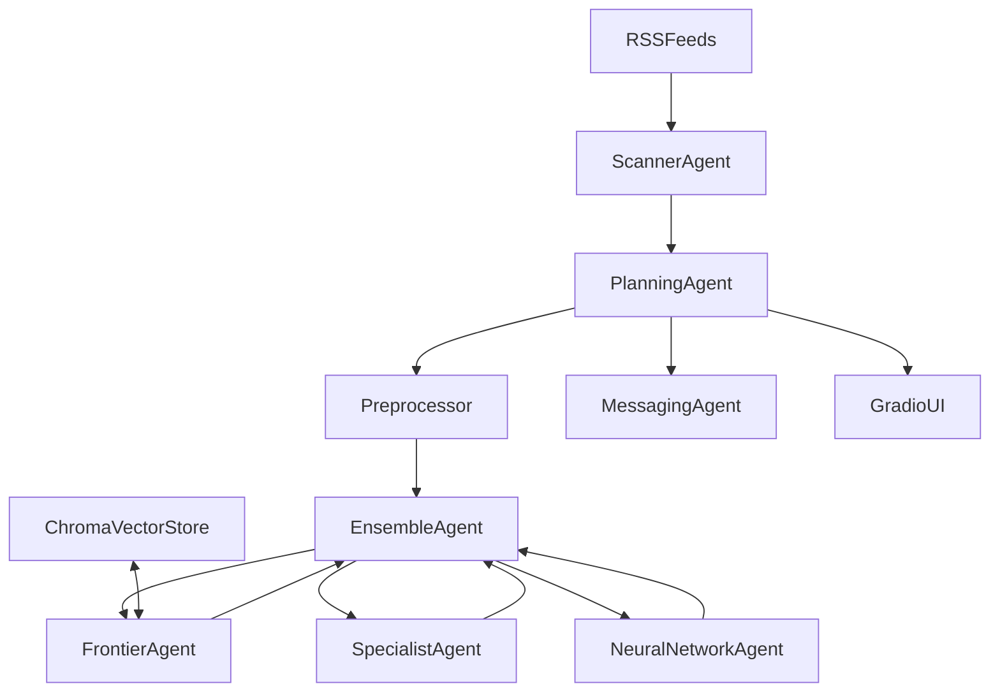

# Deal Hunter

Deal Hunter is a multi-agent system for estimating product prices and surfacing high-value electronics deals. It combines retrieval-augmented LLM pricing, a fine-tuned specialist model on Modal, and (planned) additional agents and orchestration. Prototype work lives in `notebooks/`; stable code lives in `src/deal_hunter`.

## Current Status

Implemented now:

- `Item` data model + Hugging Face dataset loading in `src/deal_hunter/agents/items.py`
- Modal fine-tuned pricing service (`Pricer`) in `src/deal_hunter/services/pricer.py`
- LiteLLM-based product preprocessor in `src/deal_hunter/services/preprocessing.py`
- Evaluation utilities (`Tester`, `evaluate`) in `src/deal_hunter/services/testing.py`
- Exploration notebooks in `notebooks/`

Planned next:

- Centralized config (`pydantic-settings`)
- Pure Pydantic deal models
- RSS scraping service, vector store service, notification service
- Agent suite (`Scanner`, `Frontier`, `Specialist`, `NeuralNetwork`, `Ensemble`, `Messaging`, `Planning`)
- End-to-end `main.py` orchestration and Gradio dashboard
- Automated tests and a polished exploration notebook

## Target Architecture



Note: several components above are planned and not implemented in `src/` yet.

## Repository Layout

- `src/deal_hunter/` — package code (services, agents, models, ui, nn)
- `notebooks/` — experiments and benchmarks
- `error_docs/errors.md` — troubleshooting notes and major build fixes
- `.cursor/plans/` — internal planning notes (optional for contributors)

## Prerequisites

- Python 3.11+ (project currently uses 3.12)
- `uv` package manager
- Accounts/tokens for:
  - Hugging Face (`HF_TOKEN`)
  - OpenAI-compatible provider key (`OPENAI_API_KEY`) for RAG / frontier-style notebook cells
  - Modal authentication for remote specialist pricing

## Quickstart

### 1) Install dependencies

```bash
uv sync
```

### 2) Configure environment

Create a `.env` in repo root with at least:

```bash
HF_TOKEN=your_huggingface_token
OPENAI_API_KEY=your_openai_key
```

Optional (for notifications when that path is implemented):

```bash
PUSHOVER_USER=your_pushover_user_key
PUSHOVER_TOKEN=your_pushover_api_token
```

### 3) Authenticate Modal (for `Pricer` remote calls)

```bash
uv run modal token new
uv run modal token set --token-id <id> --token-secret <secret>
```

### 4) Run notebooks

```bash
uv run jupyter lab notebooks/ensemble_agent.ipynb
```

or

```bash
uv run jupyter lab notebooks/modal_preprocessing.ipynb
```

### 5) Deploy specialist pricing service (optional)

```bash
uv run modal deploy src/deal_hunter/services/pricer.py
```

## Development workflow

1. Iterate in `notebooks/` for fast experiments.
2. Validate with small benchmarks where useful.
3. Promote stable logic into typed, testable modules under `src/deal_hunter/`.

## Roadmap

- Scaffolding and centralized settings
- `models/deals.py` and related Pydantic types
- RSS, vector store, notifications, and preprocessing hardening
- Base agent abstraction and full multi-agent stack
- `main.py` entrypoint for the full pipeline
- Modal deployment polish
- Gradio dashboard
- Test suite and exploration notebook cleanup

## Known gaps

- CLI entry `deal-hunter = deal_hunter.main:main` is declared in `pyproject.toml`, but `deal_hunter/main.py` is not implemented yet.
- RSS ingestion, vector retrieval, and orchestration agents are still to be ported from notebook prototypes into `src/`.

## Troubleshooting

See `error_docs/errors.md` for practical fixes around:

- Modal cold-start and serving patterns
- Generation `attention_mask` issues
- GPU memory constraints on T4
- Chroma persistence path / working-directory pitfalls

## Contributing notes

- Treat `notebooks/` as exploratory; keep `src/` production-oriented.
- Use Pydantic v2 models and config-driven patterns.
- Prefer dependency injection between services and agents.
- Centralize model and provider choices once `config.py` exists.
