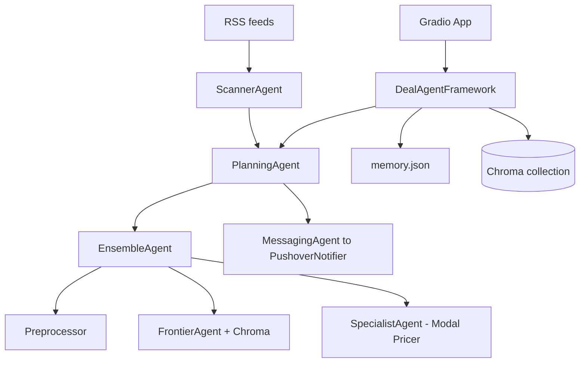

# Deal Hunter

Deal Hunter scans RSS electronics feeds, estimates fair value for each deal with an ensemble, and pushes notifications when a discount clears a threshold.

The code you should treat as source of truth is in `src/deal_hunter/`. Notebooks in `notebooks/` are for experiments.

## What is implemented now

- **Config layer**: `src/deal_hunter/config.py` uses `pydantic-settings` and loads `.env`.
- **Typed models**: `src/deal_hunter/models/deals.py` defines `ScrapedDeal`, `Deal`, `DealSelection`, and `Opportunity`.
- **RSS ingestion**: `src/deal_hunter/services/rss.py` parses feeds, fetches deal pages, and normalizes content.
- **Pricing stack**:
  - `src/deal_hunter/services/preprocessing.py` rewrites product text with LiteLLM.
  - `src/deal_hunter/agents/frontier.py` does Chroma-based retrieval plus LLM price estimation.
  - `src/deal_hunter/agents/specialist.py` calls a Modal-hosted fine-tuned model.
  - `src/deal_hunter/agents/ensemble.py` combines frontier + specialist predictions with configured weights.
- **Orchestration**:
  - `src/deal_hunter/agents/scanner.py` extracts top deal candidates using structured output.
  - `src/deal_hunter/agents/planner.py` scores deals and triggers notifications above threshold.
  - `src/deal_hunter/framework.py` manages memory (`memory.json`), Chroma collection, and end to end runs.
  - `src/deal_hunter/agents/autonomous_planner.py` includes a tool-calling autonomous planner variant.
- **Notifications**: `src/deal_hunter/services/notifications.py` sends Pushover messages.
- **UI**: `src/deal_hunter/ui/app.py` provides a Gradio dashboard with periodic runs and live logs.
- **Evaluation helper**: `src/deal_hunter/services/testing.py` includes `Tester` and `evaluate(...)`.

## Current architecture


```mermaid
flowchart TD
    rss["RSS feeds"] --> scanner["ScannerAgent"]
    scanner --> planner["PlanningAgent"]
    planner --> ensemble["EnsembleAgent"]
    ensemble --> preprocessor["Preprocessor"]
    ensemble --> frontier["FrontierAgent + Chroma"]
    ensemble --> specialist["SpecialistAgent - Modal Pricer"]
    planner --> notifier["MessagingAgent to PushoverNotifier"]
    framework["DealAgentFramework"] --> planner
    framework --> memory["memory.json"]
    framework --> chroma[(Chroma collection)]
    ui["Gradio App"] --> framework
```

## Repository layout

- `src/deal_hunter/agents/` agent implementations and orchestration logic.
- `src/deal_hunter/services/` integration services (RSS, notifications, preprocessing, Modal pricer, testing).
- `src/deal_hunter/models/` pydantic domain models for deals and opportunities.
- `src/deal_hunter/ui/` Gradio app and log formatting.
- `notebooks/` scratch work and experiments.
- `error_docs/errors.md` practical notes for build/runtime issues.

## Prerequisites

- Python 3.11+ (the project currently uses 3.12)
- `uv`
- API/auth setup for:
  - OpenAI-compatible provider (`OPENAI_API_KEY`)
  - Hugging Face (`HF_TOKEN`) for model/dataset access
  - Modal auth for specialist pricing
  - Pushover credentials if you want push alerts

## Setup

### 1) Install dependencies

```bash
uv sync
```

### 2) Create `.env`

At minimum:

```bash
OPENAI_API_KEY=your_key
HF_TOKEN=your_hf_token
```

Common extras:

```bash
GROQ_API_KEY=your_groq_key
OPEN_ROUTER_API_KEY=your_openrouter_key
PUSHOVER_USER=your_pushover_user
PUSHOVER_TOKEN=your_pushover_token
```

## Running the project

### Launch the Gradio app

```bash
uv run python -m deal_hunter.ui.app
```

### Run one framework cycle from terminal

```bash
uv run python -m deal_hunter.framework
```

### Deploy the Modal pricer service

```bash
uv run modal deploy src/deal_hunter/services/pricer.py
```

## Notes and known gaps

- `pyproject.toml` declares `deal-hunter = deal_hunter.main:main`, but `src/deal_hunter/main.py` does not exist yet.
- `src/deal_hunter/nn/` is currently a placeholder package.
- There is a second ensemble/orchestration path in `src/deal_hunter/agents/autonomous_planner.py`; the default path used by the UI goes through `DealAgentFramework` + `PlanningAgent`.

## Development workflow

1. Experiment in `notebooks/`.
2. Move stable code into `src/deal_hunter/`.
3. Keep runtime settings in `src/deal_hunter/config.py` and `.env`.
4. Check `error_docs/errors.md` when troubleshooting Modal, memory, or retrieval issues.
