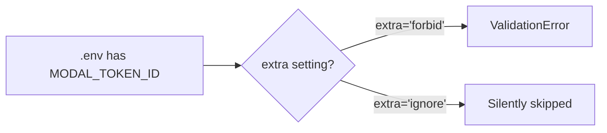
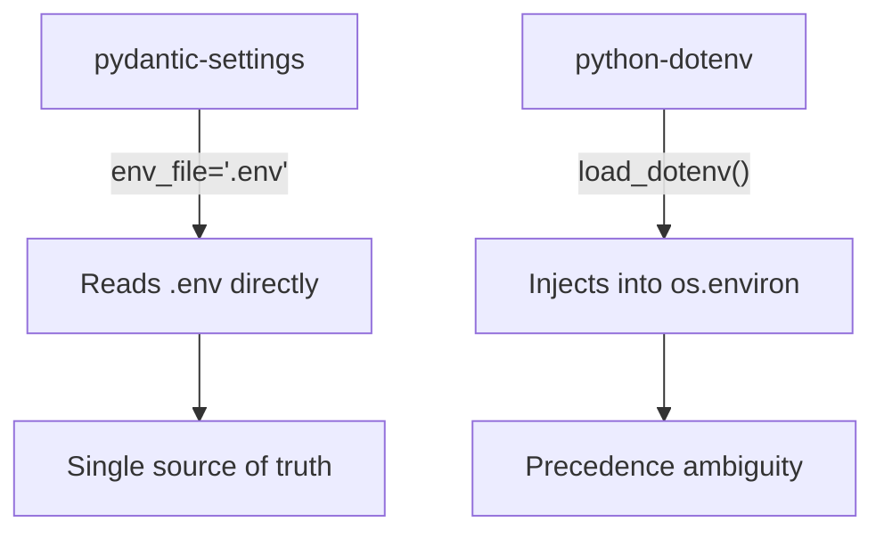
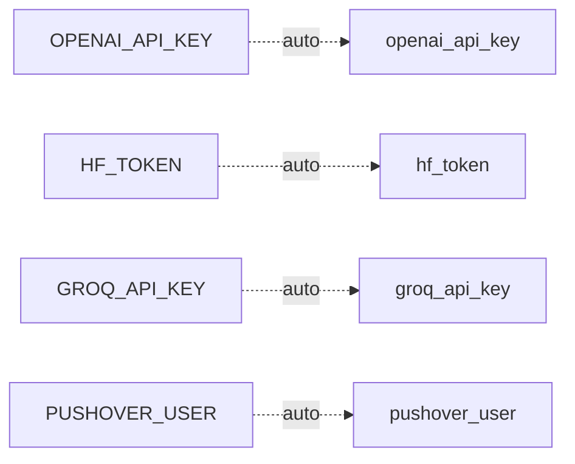
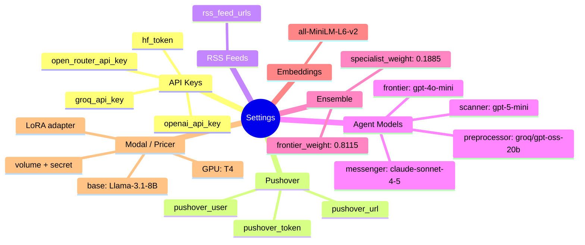

# Config layer: decisions and learnings

## The problem

Model names, API keys, and magic numbers were copy-pasted into every agent and service file. Changing the frontier model from `gpt-4o-mini` to something else meant editing `frontier.py`, then checking if `ensemble.py` or `preprocessing.py` also referenced it. Easy to miss one.

Files that had hardcoded config:

- `frontier.py` -- model name, embedding model, reasoning effort
- `ensemble.py` -- weight split (0.8115 / 0.1885)
- `preprocessing.py` -- model name, reasoning effort, its own `load_dotenv()` call
- `pricer.py` -- GPU type, base LLM, LoRA adapter ID, Modal volume/secret names
- `scanner_agent.py` -- model name
- `messaging_agent.py` -- model name, `os.getenv()` for Pushover creds
- `deals.py` -- RSS URLs, discount threshold

## What we did

One `pydantic-settings` class reads `.env` on init and holds every config value with defaults.

```mermaid
graph LR
    ENV[".env file"] -->|auto-read| S["Settings()"]
    S --> F[frontier.py]
    S --> EN[ensemble.py]
    S --> PP[preprocessing.py]
    S --> PR[pricer.py]
    S --> SC[scanner.py]
    S --> MS[messaging.py]

    style S fill:#1a3a1a,stroke:#4ecdc4
```



Import: `from deal_hunter.config import settings`

## Design decisions

### 1. `extra="ignore"` in SettingsConfigDict

`.env` has keys like `MODAL_TOKEN_ID` that don't map to any field on Settings. By default pydantic validates extras and throws a `ValidationError`. Setting `extra="ignore"` tells it to skip unknown keys quietly.




### 2. Empty string defaults for secrets

Not every context needs every key. A notebook exploring embeddings doesn't care about Pushover creds. If secrets were required fields, importing `settings` would crash before you got to do anything useful.

| Alternative | What goes wrong |
|---|---|
| No default (required) | Import crashes when key is absent |
| `None` default | Consumers need explicit `is None` checks everywhere |
| `""` default | `if settings.key` just works |

Each agent validates its own keys at init time. The config layer doesn't enforce which keys you actually need.

### 3. Module-level singleton

```python
settings = Settings()  # bottom of config.py
```

One instance, created once. pydantic-settings reads `.env` at instantiation, so this avoids re-reading the file on every import.

### 4. No load_dotenv

pydantic-settings reads `.env` natively through `env_file=".env"`. Calling `load_dotenv()` on top of that is redundant and introduces a precedence question: does the os environment or the file win?



### 5. Defaults match existing hardcoded values

Every default is copied from what the code already had. Nothing breaks on day one. Migration happens later, one file at a time.

## Env variable auto-mapping

pydantic-settings converts `snake_case` field names to `UPPER_CASE` env vars on its own:



No `os.getenv()` anywhere.

## Field groups



## Migration plan

The first step only creates the config module. No existing code gets touched yet.

```mermaid
gantt
    title Config migration rollout
    dateFormat X
    axisFormat %s

    section Done
    Create Settings class           :done, 0, 1

    section Next
    ScannerAgent uses settings      :5, 6
    MessagingAgent uses settings    :6, 7
    Migrate frontier.py             :7, 8
    Migrate ensemble.py             :8, 9
    Migrate preprocessing.py        :9, 10
```



Each agent swaps its hardcoded values for `settings.<field>` one at a time.
