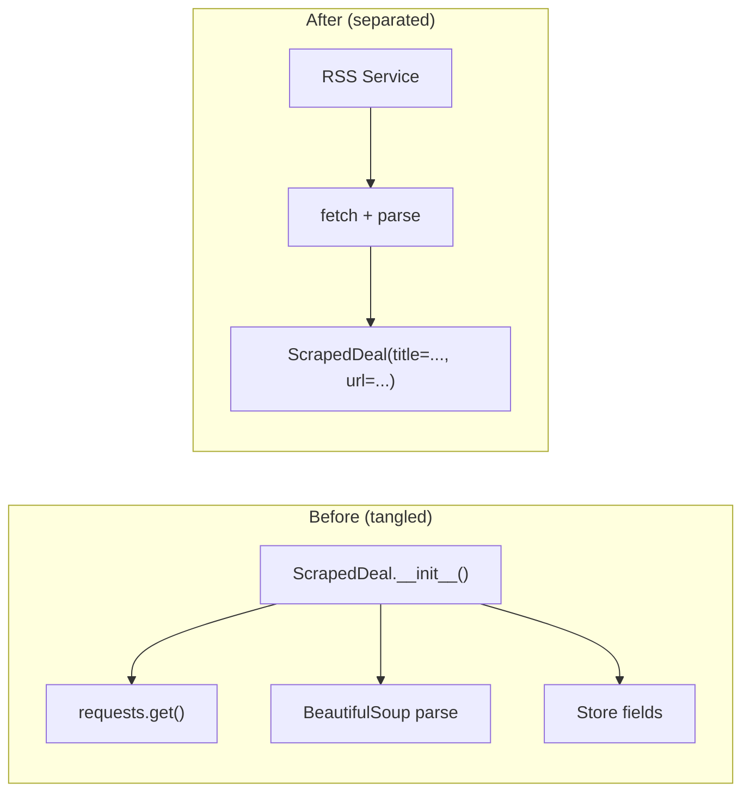
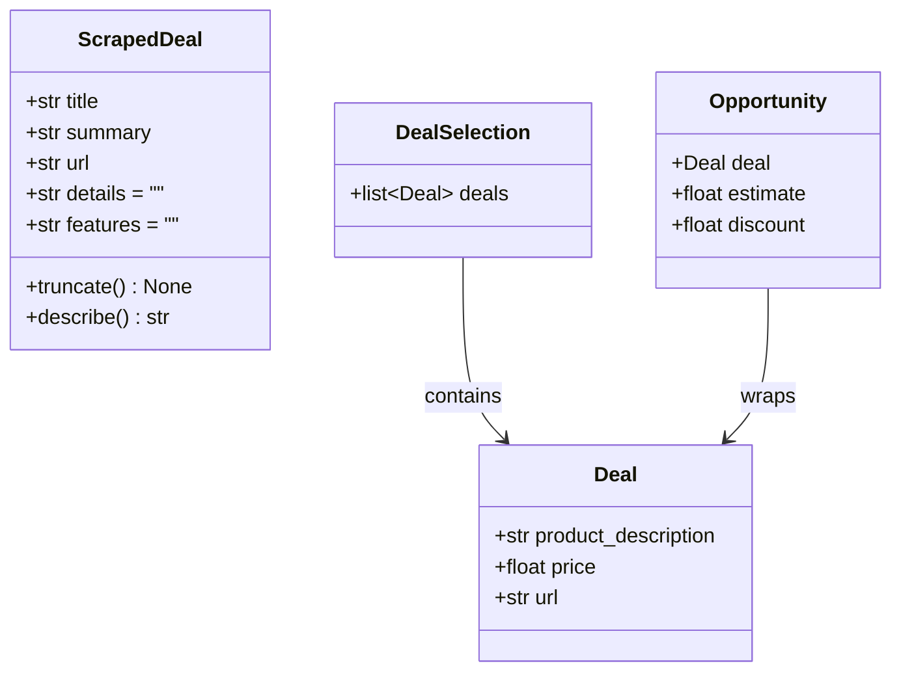
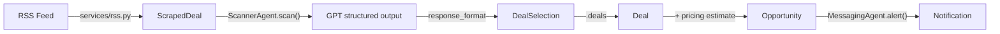

# Data models: decisions and learnings

## The problem

The original `agents/deals.py` defined four data classes that flow through the deal-hunting pipeline. The biggest one, `ScrapedDeal`, did three jobs at once: held deal data, fetched product pages over HTTP, and parsed HTML with BeautifulSoup. All of this happened inside `__init__`, so constructing a `ScrapedDeal` triggered a network request. You couldn't create one in a test without hitting the internet.

The other three models (`Deal`, `DealSelection`, `Opportunity`) were cleaner, but their `Field(description=...)` prompts were written quickly and could give GPT wrong signals.

## Design decisions

### 1. Separate data from I/O

The original `ScrapedDeal.__init__` accepted a raw feedparser entry dict, then immediately called `requests.get()` to fetch the product page and parsed it with BeautifulSoup. That means:

- You can't construct a `ScrapedDeal` without a network connection
- If one HTTP request fails, the whole batch crashes (no error handling)
- Unit tests need mocking or real network access
- The model file pulls in `requests`, `feedparser`, `BeautifulSoup`, `tqdm`, `time` — none of which belong in a data model



`ScrapedDeal` becomes a plain `BaseModel` with five keyword arguments. The RSS service handles fetching and parsing, then constructs `ScrapedDeal` instances with the data it extracted.

### 2. Don't override `__init__` on Pydantic BaseModel

An earlier version inherited from `BaseModel` but overrode `__init__` with direct attribute assignment:

```python
class ScrapedDeal(BaseModel):
    def __init__(self, entry: Dict[str, str]) -> None:
        self.title = entry["title"]
        # ...
```

Pydantic v2's `BaseModel.__init__` runs field validation, type coercion, and default population. Bypassing it with `self.title = ...` skips all of that — either a `ValidationError` at runtime, or validation silently never happens.

The proper pattern: declare fields on the class, let consumers construct via keyword arguments. If you need to transform input data before constructing the model, do it in the service layer and pass clean values in.

### 3. No config access in model files

```python
feeds = settings.rss_feed_url
```

Reading config at module import time means importing `deals.py` immediately triggers `.env` loading and Settings validation. If `.env` is missing or incomplete, the import fails before you can use any of the models. Config belongs in the service that needs it, not in the models file.


## What the clean version should look like



The target is four `BaseModel` subclasses with no I/O. The only imports should be `pydantic` and `typing`. Everything else (`requests`, `BeautifulSoup`, `feedparser`, `extract()`, `fetch()`, `sys.path` hack, module-level `feeds`) moves to `services/rss.py`.

### ScrapedDeal

Five fields. `details` and `features` default to empty string because the RSS service might fail to fetch the product page, and we still want a valid object with the RSS-level data (title, summary, url).

`truncate()` and `describe()` stay as methods — they encode domain logic (context window limits, prompt formatting) that the ScannerAgent depends on.

### Deal

Three fields with `Field(description=...)` prompts. These descriptions are instructions to GPT, not documentation. The `product_description` prompt tells GPT to focus on the product (brand, model, specs) and skip discount language. The `price` prompt tells GPT to do arithmetic on "$X off $Y" patterns. The `url` prompt tells GPT to preserve the URL exactly.

### DealSelection

Wrapper around `list[Deal]`. OpenAI structured outputs require a top-level object, not a bare list.

### Opportunity

Composes a `Deal` with a price estimate and discount percentage. Created after the pricing agents run. Used by MessagingAgent to format push notifications.

## How these models flow through the system



## Downstream contracts

These models need to satisfy:

| Consumer | What it uses |
|---|---|
| RSS Service (`services/rss.py`) | Constructs `ScrapedDeal(title=..., summary=..., url=..., details=..., features=...)`, calls `truncate()` |
| ScannerAgent (`agents/scanner.py`) | Calls `deal.describe()` on each `ScrapedDeal`, passes `DealSelection` as `response_format`, filters `result.deals` by `deal.price > 0` |
| MessagingAgent (`agents/messaging.py`) | Reads `opportunity.deal.price`, `opportunity.estimate`, `opportunity.discount`, `opportunity.deal.product_description`, `opportunity.deal.url` |
