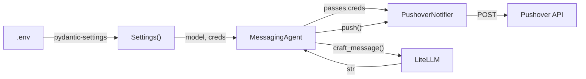

# Messaging agent: decisions and learnings

## The problem

The earlier `MessagingAgent` tried to do everything itself. It read `PUSHOVER_USER` and `PUSHOVER_TOKEN` from env vars with `os.getenv()`, built an HTTP payload, POSTed to Pushover with zero error handling, and called an LLM to craft notification text. The model name was a class constant. If the LLM call failed, the whole pipeline crashed.

I already extracted the Pushover transport into [`PushoverNotifier`](notification_service_guide.md) in Phase 4. This phase wires the agent to use that notifier and fixes the rest.

## What we built

`agents/messaging.py` contains `MessagingAgent`, which extends the base `Agent` class for colored logging.

### Constructor

```python
def __init__(
    self,
    notifier: PushoverNotifier | None = None,
    model: str | None = None,
):
    self.model = model if model is not None else settings.messenger_model

    if notifier is None:
        self.notifier = PushoverNotifier(
            settings.pushover_user,
            settings.pushover_token,
        )
    else:
        self.notifier = notifier
```

Both dependencies default to `None`. If no notifier is passed, one gets built from [`settings`](config_layer_guide.md) values. If no model is passed, `settings.messenger_model` kicks in (currently `gpt-4o-mini`). `MessagingAgent()` works zero-arg in production; `MessagingAgent(notifier=fake, model="test-model")` works in tests.

I had a bug here that ate some time. The first attempt called `PushoverNotifier(...)` in the `if notifier is None` branch but never assigned the result to `self.notifier`. The instance got created, garbage-collected, and `self.notifier` stayed `None`. Every call to `push()` crashed with `'NoneType' has no attribute 'send'`. Wrote it up in `error_docs/errors.md` as Problem 10.

### push()

```python
def push(self, text: str) -> bool:
    return self.notifier.send(text)
```

One-liner that delegates to `PushoverNotifier.send()` and returns the bool. Callers can check if the notification actually went through.

### alert()

Formats an [`Opportunity`](data_models_guide.md) into a push notification string: price, estimate, discount, truncated product description, URL. Returns the bool from `push()`.

The earlier version truncated the product description at 10 characters, which gave you notifications like "Deal: The H... $178.00". Not useful. This version uses 80 characters so you can actually tell what the product is.

### craft_message()

Calls an LLM (via LiteLLM) to write 2-3 sentences about a deal. System prompt sets the tone ("concise, exciting push notifications"), user prompt gives the product details.

```python
from litellm import completion  # lazy import inside the method
```

The `litellm` import is lazy (inside the method body, not at the top of the file). The installed `litellm` package was corrupted at one point (its `main.py` started with raw markdown instead of Python), and a top-level import made the entire `agents` package fail to load. Moving the import inside `craft_message()` means the agent class loads fine, and the error only shows up when you actually try to call the LLM. Problem 11 in `error_docs/errors.md`.

Error handling: the LLM call sits in a try/except. If it fails, the method logs the error and returns a plain fallback string built from the inputs. If the LLM responds but `message.content` is `None` or blank, same fallback. The return type is always `str`, never `None`. This matters because `notify()` slices the result with `text[:200]`, which would crash on `None`.

The fallback logic lives in a private `_fallback_craft_message()` method so both the exception path and the empty-response path use the same code.

### notify()

The end-to-end method: craft a message, truncate to 200 characters, append URL, push.

```python
def notify(self, description, deal_price, estimated_true_value, url) -> bool:
    text = self.craft_message(description, deal_price, estimated_true_value)
    text = text[:200] + "..." + url
    ok = self.push(text)
    return ok
```

Returns `bool` so the caller knows if the notification made it.

## Compared to the earlier version

| Aspect | Before | Now |
|---|---|---|
| Pushover logic | Inline `requests.post`, no error handling | Delegated to injected [`PushoverNotifier`](notification_service_guide.md) |
| Credentials | `os.getenv()` with fallback strings | From [`settings`](config_layer_guide.md), passed to notifier constructor |
| LLM model | Class constant | `settings.messenger_model`, overridable in constructor |
| LLM call fails | Unhandled exception crashes everything | try/except with fallback message |
| LLM returns `None` body | `TypeError` downstream | Coalesced to fallback string |
| Description in `alert()` | 10-char truncation (useless) | 80-char truncation (readable) |
| Return values from methods | `None` | `bool` from `push`, `alert`, `notify` |

## Bugs I hit

**Problem 10 (notifier not assigned).** `PushoverNotifier(...)` without `self.notifier =` on the left side. Constructed an object and immediately threw it away. `push()` crashed on `None.send()`. Fix: one-line assignment with `or`.

**Problem 11 (top-level litellm import).** `from litellm import completion` at module level. When the package was corrupted, importing `MessagingAgent` (or anything from `deal_hunter.agents`) failed with `SyntaxError` before any class definition ran. Fix: lazy import inside `craft_message()`.

**Circular import.** `services/rss.py` imports `deal_hunter.agents.agent` for the base `Agent` class. Python loads the `agents` package by running `agents/__init__.py`, which eagerly imports `scanner.py`, which imports `services/rss.py` - the module that's still initializing. Fix: `agents/__init__.py` uses a `__getattr__` lazy-import pattern so `ScannerAgent` and `MessagingAgent` only load when accessed by name. The `Agent` base class loads without triggering the cycle.

## How it connects



[`ScannerAgent`](scanner_agent_guide.md) finds deals. Downstream pricing agents estimate their value. `MessagingAgent` takes that information, asks an LLM to write something about it, and pushes the result to your phone through the [`PushoverNotifier`](notification_service_guide.md) built in Phase 4.

## Files touched

| File | What changed |
|---|---|
| `src/deal_hunter/agents/messaging.py` | New file, the agent |
| `src/deal_hunter/agents/__init__.py` | Added lazy `MessagingAgent` re-export (also fixed circular import) |
| `src/deal_hunter/config.py` | `messenger_model` changed from `claude-sonnet-4-5` to `gpt-4o-mini` |
| `notebooks/scanning.ipynb` | Added cells 20-28: MessagingAgent smoke tests and full scan-to-notify pipeline |

## What comes next

All eight phases of the day 3 plan are done. The pipeline can scan RSS feeds, pick deals, and push notifications. The missing pieces are the pricing agents (FrontierAgent, SpecialistAgent, EnsembleAgent) that sit between scanning and messaging. They estimate what a deal is actually worth so the messenger can report a real discount, not the `deal.price * 2` placeholder used in the notebook.
