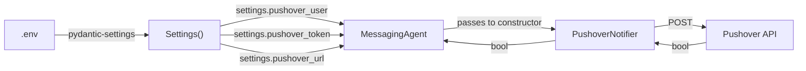

# Notification service: decisions and learnings

## The problem

The earlier `MessagingAgent` handled two unrelated jobs in one class: crafting messages with an LLM and sending HTTP requests to Pushover. The push notification logic sat inside the same object that called GPT, and it had three issues that compound each other.

First, credentials came from `os.getenv()` with hardcoded fallback strings like `"your-pushover-user-if-not-using-env"`. I already have a `Settings` class that reads `.env` through pydantic-settings. Two credential sources means two places to debug when a key goes missing.

Second, the HTTP response got thrown away. `requests.post(pushover_url, data=payload)` returns a response object. The old code never looked at it. Pushover returns `{"status":1}` on success and `{"status":0, "errors":["..."]}` on failure. If your token expires mid-run, deals still get found, but notifications silently stop arriving. You'd find out the next morning when you check your phone and there's nothing.

Third, there was no timeout on the POST. If Pushover is slow or down, the whole pipeline blocks indefinitely. No exception handling either, so a network error crashes the agent.

## What we built

`services/notifications.py` contains `PushoverNotifier`, a class that owns the Pushover HTTP call and nothing else. No LLM, no message formatting, no credential reading from env vars.

### Constructor

Takes `user_key`, `token`, and `url` as plain arguments. Whoever creates the notifier decides where those values come from. In production, `MessagingAgent` will pass `settings.pushover_user` and `settings.pushover_token`. In a test, you pass whatever you want. The URL defaults to Pushover's API endpoint but can be pointed at a mock server.

### send()

Builds a payload dict, POSTs it with a 10-second timeout, checks the HTTP status, parses the JSON body, and verifies `response["status"] == 1`. Returns `True` on success, `False` on any failure. Three separate try/except blocks handle network errors, bad HTTP status codes, and malformed JSON independently.

Returning a bool instead of raising was a deliberate choice. The caller (eventually `MessagingAgent`) decides what to do about failure. Maybe it retries. Maybe it logs and moves on. That decision belongs to the agent, not the transport layer.

### What send() does not do

No message formatting. It takes a string and sends it. Turning an `Opportunity` into notification text is the agent's job.

No reading from `settings` or `os.environ`. Credentials come through the constructor.

No truncation. Pushover silently chops messages at 1024 characters. We log a warning when the message is over that limit so at least somebody knows.

## Error handling compared to before

| Situation | Before | Now |
|---|---|---|
| Invalid token | Silent failure, response never checked | Logs the error body from Pushover, returns `False` |
| Network timeout | No timeout set, blocks forever | 10-second timeout, caught and logged, returns `False` |
| Pushover is down | Unhandled exception crashes the agent | Same as timeout handling |
| Message over 1024 chars | Silently truncated by Pushover | Logs a warning before sending |

## Why it extends Agent

Same reason as `Rss_Service`. Extending `Agent` gives colored, name-prefixed logging (`[Pushover Notifier]` in magenta) without writing any logging boilerplate. The cost is one line in the constructor.

## Where credentials come from

The notifier never touches config or env vars. It gets three strings and uses them. This is the same dependency injection pattern as passing feed URLs into `Rss_Service.scrape_feeds()`.

## Config values

Phase 1 already added these to `Settings`:

| Field | Default |
|---|---|
| `pushover_user` | `""` |
| `pushover_token` | `""` |
| `pushover_url` | `"https://api.pushover.net/1/messages.json"` |

Empty string defaults mean importing `settings` won't crash in contexts that don't need Pushover. The notifier constructor accepts whatever it's given. Validation (are these credentials real?) happens when you actually call `send()` and Pushover tells you.

## What comes next

`PushoverNotifier` is the transport layer. Phase 6 builds `MessagingAgent` on top of it, which handles LLM message crafting (`craft_message()`) and the `notify()` method that formats an `Opportunity` into human-readable text before handing it to `send()`.
