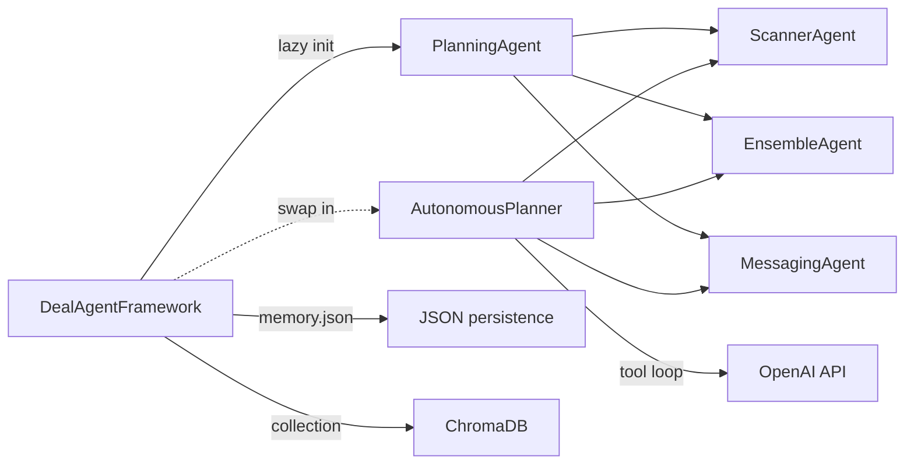
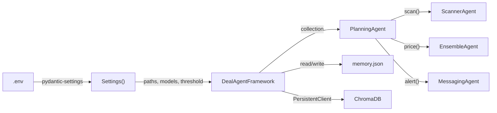

# Planning agent and framework: decisions and learnings

## What this phase adds

Scanning, pricing, and messaging each existed as a separate agent. Nothing tied them together. This phase wires them into a single `plan()` call, first as a deterministic pipeline (`PlanningAgent`) and then as an LLM-driven tool-calling loop (`AutonomousPlanner`). Both sit behind a `DealAgentFramework` that owns the ChromaDB handle and the on-disk memory of deals we've already sent.

## The problem

Before this, you had to call each agent by hand. Fetch deals with `ScannerAgent`, feed them into `EnsembleAgent` one at a time, sort by discount, decide the threshold in your head, pass the winner to `MessagingAgent.alert()`. Fine for one run. A mess when you want it to loop on a timer or when you need "don't alert on the same URL twice."

Two things were also wrong in the pricing agents and had to be fixed before they could sit inside a planner:

- `FrontierAgent` had `MODEL = "gpt-40-mini"` (forty, not four-oh) as a hardcoded override. Any call that reached the model would 404 the OpenAI API.
- `EnsembleAgent` hardcoded the two ensemble weights (`0.8115...` and `0.1885...`) inside `price()`. The values came from a linear regression fit, but they lived as magic numbers in the agent body instead of in `settings`.

Both are in `error_docs/errors.md` as Problems 12 and 13.

## What we built

Three files do the work: `agents/planner.py`, `agents/autonomous_planner.py`, and `framework.py`.



### PlanningAgent (deterministic)

The constructor takes a Chroma collection and optional sub-agents. If you don't pass sub-agents, it builds them from config.

```python
def __init__(self, collection, scanner=None, ensemble=None, messenger=None):
    self.scanner = scanner or ScannerAgent()
    self.ensemble = ensemble or EnsembleAgent(collection)
    self.messenger = messenger or MessagingAgent()
```

The same DI pattern already shows up in `ScannerAgent` and `MessagingAgent`. Defaulting to `None` and falling back to real instances means `PlanningAgent(collection)` works in production and `PlanningAgent(collection, scanner=fake, ensemble=fake, messenger=fake)` works in tests.

`run(deal)` turns a single `Deal` into an `Opportunity` by asking the ensemble for an estimate and subtracting the listed price.

```python
def run(self, deal: Deal) -> Opportunity:
    estimate = self.ensemble.price(deal.product_description)
    discount = estimate - deal.price
    return Opportunity(deal=deal, estimate=estimate, discount=discount)
```

`plan(memory)` is the orchestrator. It pulls already-seen URLs out of the memory list (`list[Opportunity]`, not `list[str]`), passes them to the scanner, prices every returned deal, sorts by discount, and alerts if the best one clears `settings.deal_threshold`.

```python
known_url = [opp.deal.url for opp in memory] if memory else []

selection = self.scanner.scan(memory=known_url)
if not selection:
    return None

opportunities = [self.run(deal) for deal in selection.deals[:5]]
opportunities.sort(key=lambda opp: opp.discount, reverse=True)
best = opportunities[0]

if best.discount > settings.deal_threshold:
    self.messenger.alert(best)
    return best
return None
```

Two small choices worth calling out. `memory` is typed as `list[Opportunity] | None`, and the agent extracts URLs internally. That way callers persist rich deal objects and the planner still gets the `set[str]` the scanner actually needs. The threshold is `settings.deal_threshold`, not a class constant, so you can tighten or loosen it without editing code.

### AutonomousPlanner

Same three sub-agents. Same `plan(memory)` signature. The difference is the body: instead of hard-coded scan-then-price-then-alert, the agent hands the LLM three tools and lets the model decide the sequence.

Tools, in OpenAI function-calling format:

- `deal_scanner` takes no args, returns the `DealSelection` as JSON or `"No Deals Found"`.
- `estimate_value(description)` calls `self.ensemble.price()` and returns a formatted string.
- `message_user(description, deal_price, estimated_true_value, url)` calls `self.messenger.notify()`, builds an `Opportunity`, and stores it on `self.opportunity`.

`plan()` runs a `while not done` loop:

```python
while not done:
    response = self.openai.chat.completions.create(
        model=self.model,
        messages=messages,
        tools=self.get_tools(),
    )
    choice = response.choices[0]

    if choice.finish_reason == "tool_calls":
        messages.append(choice.message)
        messages.extend(self.handle_tools(choice.message))
    else:
        done = True

return self.opportunity
```

`handle_tools(message)` dispatches each tool call to the matching Python method, captures the return value, and wraps it in the `{"role": "tool", "content": ..., "tool_call_id": ...}` shape the OpenAI API wants in the next turn.

### The single-notify guard

LLMs occasionally decide one notification is not enough. `message_user` checks `self.opportunity` before sending, and on the second call it returns `"Notification Already sent;Duplicate(Ignore)"` without touching Pushover.

```python
def message_user(self, description, deal_price, estimated_true_value, url) -> str:
    if self.opportunity:
        return "Notification Already sent;Duplicate(Ignore)"
    self.messenger.notify(description, deal_price, estimated_true_value, url)
    deal = Deal(product_description=description, price=deal_price, url=url)
    discount = estimated_true_value - deal.price
    self.opportunity = Opportunity(deal=deal, estimate=estimated_true_value, discount=discount)
    return "Notification Sent"
```

`plan()` resets `self.opportunity` to `None` at the top of every run, so one duplicate notification inside a run is blocked but the next run is free to notify again.

### DealAgentFramework

The framework opens Chroma, loads memory, and defers planner creation until the first `run()` call. Building a planner instantiates `EnsembleAgent`, which loads a `SentenceTransformer` model and connects to the Modal `Pricer` app. That's expensive. No reason to pay for it if you only came to inspect memory.

```python
def __init__(self):
    client = chromadb.PersistentClient(path=settings.vectorstore_path)
    self.collection = client.get_or_create_collection(settings.vectorstore_collection)
    self.memory = self._read_memory()
    self.planner = None

def _init_planner(self) -> None:
    if not self.planner:
        self.planner = PlanningAgent(self.collection)

def run(self) -> list[Opportunity]:
    self._init_planner()
    result = self.planner.plan(memory=self.memory)
    if result:
        self.memory.append(result)
        self._write_memory()
    return self.memory
```

Memory is a JSON file on disk (`settings.memory_filename`, default `memory.json`) containing a list of serialised `Opportunity` objects. `_read_memory()` returns `[]` if the file isn't there yet, so first-run crashes are not a thing. `_write_memory()` dumps the current list back with `indent=2` so the file stays human-readable.

`reset_memory()` is a classmethod that truncates the file to its first two entries. It's there so I can keep a couple of known deals around for smoke tests without having to keep regenerating them.

### Swapping planners

Right now `_init_planner()` hardcodes `PlanningAgent(self.collection)`. The two planners share the same `plan(memory) -> Opportunity | None` signature, so swapping is a one-line change in the framework or a constructor argument if you want both available at once. I left it concrete because I only ever run the deterministic one from the UI.

## Bugs I hit

**Problem 12 (frontier model typo).** `self.MODEL = "gpt-40-mini"` inside `FrontierAgent.__init__`. Fine when nothing ever hit production, because I was running `price()` against mocked data. The first real planner run surfaced an OpenAI 404 and wasted a few minutes because the traceback points at the API call, not at the string. Fix: pull the model from `settings.frontier_model` and delete the class-level override.

**Problem 13 (ensemble weights hardcoded).** Two magic floats sat inside `EnsembleAgent.price()`. The values came from a linear regression against held-out predictions, which is fine, but freezing them in code means tuning means editing code. Fix: read `settings.ensemble_frontier_weight` and `settings.ensemble_specialist_weight` in the constructor, assign to `self`, use them in `price()`.

## Compared to the earlier version

| Aspect | Before | Now |
|---|---|---|
| Pipeline wiring | Ad-hoc notebook glue | One `plan()` call through `PlanningAgent` |
| Memory type | `list[str]` of URLs | `list[Opportunity]`, planner extracts URLs |
| Deal threshold | Class constant | `settings.deal_threshold` |
| Planner variant | Deterministic only | Deterministic plus LLM tool-loop |
| Chroma lifecycle | Opened in notebooks ad hoc | Owned by `DealAgentFramework` |
| Memory persistence | None | `memory.json` read/write around each run |
| Duplicate notifications | Nothing stopping them | `self.opportunity` guard on the autonomous planner |
| Frontier model | Typo shipped as class constant | `settings.frontier_model` |
| Ensemble weights | Magic numbers in `price()` | `settings.ensemble_*_weight` |

## How the pieces fit



Every arrow out of `Settings` is a value that used to be hardcoded somewhere downstream. Every arrow out of `DealAgentFramework` is a side effect someone used to manage by hand in a notebook.

## Files touched

| File | What changed |
|---|---|
| `src/deal_hunter/agents/frontier.py` | Model and embedding names read from `settings`; `reasoning_effort` gated so non-reasoning models skip the arg |
| `src/deal_hunter/agents/ensemble.py` | Weights read from `settings` in `__init__`, used in `price()` |
| `src/deal_hunter/config.py` | Added `planner_model`, `deal_threshold`, `memory_filename`, `vectorstore_path`, `vectorstore_collection`, `ui_timer_interval` |
| `src/deal_hunter/agents/planner.py` | New `PlanningAgent` |
| `src/deal_hunter/agents/autonomous_planner.py` | New `AutonomousPlanner` |
| `src/deal_hunter/framework.py` | New `DealAgentFramework` with Chroma + memory + lazy planner |
| `src/deal_hunter/agents/__init__.py` | Added lazy `PlanningAgent` and `AutonomousPlanner` exports |
| `notebooks/scanning.ipynb` | Added smoke-test cells for `PlanningAgent` and `DealAgentFramework.run()` |

## What comes next

The planners return; the framework persists; the pipeline runs from a single entry point. The missing surface is the UI. Day 5 wraps `DealAgentFramework` in a Gradio app with a deals table, live log streaming, a row-select re-alert, and a timer that kicks off `run()` on a fixed interval. See [`ui_guide.md`](ui_guide.md).
