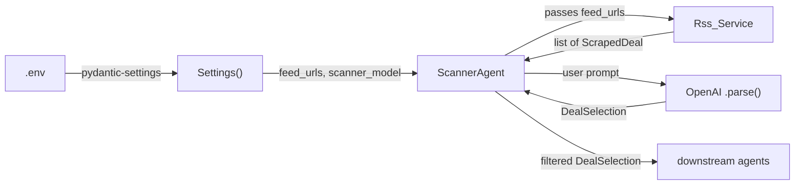

# Scanner agent: decisions and learnings

## What it does

ScannerAgent is the entry point of the deal pipeline. It does two things: pull fresh deals from RSS feeds, and ask OpenAI to pick the 5 best ones using structured outputs. Everything downstream (pricing, ensemble estimation, notifications) depends on this agent finding deals worth looking at.

## The problem

The earlier version had scraping logic baked into the data model. Constructing a `ScrapedDeal` triggered HTTP requests, which meant you couldn't create one in a test or from cached data without hitting the network. The OpenAI client was instantiated inside the constructor with no way to swap it out. Model name was a class constant. The `memory` parameter (list of already-seen URLs) had inconsistent types across methods. And the default mutable argument `memory: List[str] = []` was the classic Python footgun where every call shares the same list object.

There was also no error handling on the OpenAI call. If the API went down or you hit a rate limit, the whole pipeline crashed.

## What we built

`agents/scanner.py` contains `ScannerAgent`, which extends the base `Agent` class for colored logging.

### Constructor

```python
def __init__(
    self,
    rss: Rss_Service | None = None,
    openai_client: OpenAI | None = None,
) -> None:
    self.rss = rss or Rss_Service()
    self.openai = openai_client or OpenAI()
    self.feed_urls = settings.rss_feed_url
    self.scanner_model = settings.scanner_model
```

Both dependencies default to `None` and get created internally if nothing is passed. This means `ScannerAgent()` works out of the box for production, and `ScannerAgent(rss=mock_rss, openai_client=mock_client)` works for tests. Feed URLs and model name come from config, not class constants.

I burned time on a bug here: the first attempt declared `rss` as a required positional argument instead of optional. Then a second attempt made it optional but forgot the `or Rss_Service()` fallback, so `self.rss` stayed `None` and `scan()` crashed with `'NoneType' has no attribute 'scrape_feeds'`. Both mistakes are in `error_docs/errors.md` now.

### fetch_deals()

```python
def fetch_deals(self, memory: list[str] | None = None) -> list[ScrapedDeal]:
```

Takes a list of URL strings, converts it to a set, and passes it to `Rss_Service.scrape_feeds()`. The RSS service handles per-feed parsing, per-entry HTTP fetching, error recovery, and deduplication. The agent stays clean.

`memory` defaults to `None` instead of `[]`. Inside the body, `set(memory or [])` handles both cases without the mutable default problem.

### scan()

This is the main method. The flow is simple: fetch deals, build a prompt, call OpenAI, filter the results.

```python
def scan(self, memory: list[str] | None = None) -> DealSelection | None:
    scraped = self.fetch_deals(memory=memory)
    if not scraped:
        self.log("No new deals found")
        return None

    user_prompt = self.make_user_prompt(scraped)
    try:
        completion = self.openai.chat.completions.parse(
            model=self.scanner_model,
            messages=[...],
            response_format=DealSelection,
            reasoning_effort="minimal",
        )
    except Exception as exc:
        self.log(f"OpenAI scan failed: {exc}")
        return None
```

Two things worth calling out.

**Structured outputs.** The `response_format=DealSelection` parameter tells OpenAI to return JSON that conforms to the `DealSelection` Pydantic schema. No "please respond in JSON" in the prompt, no regex cleanup, no prayer. The `.parse()` method on the beta client handles it. `DealSelection` has a `deals` field that is a `List[Deal]`, and each `Deal` has `product_description`, `price`, and `url`. The model names and field descriptions do the prompt engineering (they're in `models/deals.py`).

**The empty-deals guard.** If RSS returns nothing, we return `None` instead of sending an empty prompt to OpenAI. I got this wrong initially by using `if scraped is None` instead of `if not scraped`. `fetch_deals` returns a list, so zero results means `[]`, not `None`. And `[] is None` is `False`. That one wasted a few minutes.

### Post-filtering

After OpenAI responds, there's one more step:

```python
parsed.deals = [deal for deal in parsed.deals if deal.price > 0]
```

The prompts tell GPT to skip deals without a clear price, but it doesn't always listen. Sometimes it includes a deal with `price: 0` as a placeholder. Filtering these out prevents garbage from reaching the pricing pipeline.

### Prompts

The system prompt and user prompt are stored as class constants (`SYSTEM_PROMPT`, `USER_PROMPT_PREFIX`, `USER_PROMPT_SUFFIX`). They instruct GPT to:

- Pick the 5 deals with the most detailed product descriptions and clear prices
- Rephrase descriptions to focus on the product, not the deal terms
- Watch out for "$XXX off" phrasing (that's a discount amount, not a price)
- Respond with exactly 5 deals

The `reasoning_effort="minimal"` parameter tells the model not to overthink it. This is a selection and summarization task, not a reasoning problem. Saves tokens.

### test_scan()

Returns a hardcoded `DealSelection` with four sample deals (Hisense TV, Poly Studio monitor, Lenovo IdeaPad, Dell G15). Useful for testing downstream agents without burning API calls or waiting for RSS feeds. The data comes back as a `DealSelection` through `model_validate()`, so downstream code can't tell the difference.

## Error handling compared to before

| Situation | Before | Now |
|---|---|---|
| OpenAI API down | Unhandled exception crashes pipeline | try/except logs the error, returns `None` |
| RSS feeds return nothing | Sends empty prompt to OpenAI, wastes tokens | Guard clause returns `None` early |
| GPT returns price = 0 | Garbage propagates downstream | Post-filter removes deals with `price <= 0` |
| Default mutable `memory=[]` | Shared state across calls | `None` default with `set(memory or [])` inside body |
| OpenAI returns no parsed content | AttributeError on `None.deals` | Explicit `if parsed is None` check |

## Why it uses the OpenAI client directly

Most of the codebase uses LiteLLM for model flexibility. The scanner doesn't. The `.parse()` method with `response_format` is an OpenAI-specific feature for structured outputs. LiteLLM has support for it, but the OpenAI client is more straightforward here since we're already depending on `openai` for the beta parse API. If we ever need to swap models, that decision can happen then.

## How it connects



The agent is a coordinator. It pulls config from `Settings`, delegates scraping to `Rss_Service`, delegates selection to OpenAI, and filters the output. None of those pieces know about each other.

## Files touched

| File | What changed |
|---|---|
| `src/deal_hunter/agents/scanner.py` | New file, the agent itself |
| `src/deal_hunter/agents/scanner_example.py` | Reference implementation with docstrings (kept separate) |
| `src/deal_hunter/agents/__init__.py` | Added `ScannerAgent` re-export |

## What comes next

ScannerAgent produces a `DealSelection` containing up to 5 `Deal` objects. The next agents in the pipeline take those deals and estimate their actual value: `FrontierAgent` uses a frontier model, `SpecialistAgent` uses a fine-tuned model on Modal, and `EnsembleAgent` combines the estimates with configurable weights. After pricing, `MessagingAgent` formats the results and pushes notifications through the `PushoverNotifier` we built in Phase 4.
