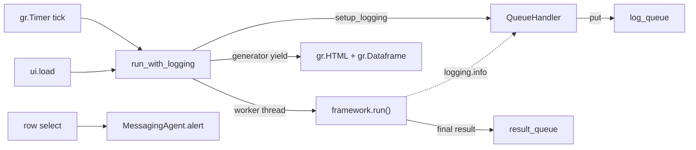
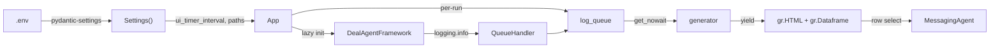

# UI layer: decisions and learnings

## The problem

The framework works fine from the command line, but running `python -m deal_hunter.framework` and watching a terminal is not the point. I want a dashboard: a table of deals the system has already sent me, a live log pane so I can see what each agent is doing while a run is in progress, and a timer that re-runs the pipeline every few minutes without me having to babysit it.

Gradio is the shortest path to that. The catch is that the framework logs to the standard `logging` module and Gradio updates come through generator yields on the main event loop. Those two do not naturally speak to each other. And the framework is expensive to construct (opens Chroma, will build a planner on first run), so the UI has to be careful about when it builds one.

## What we built

Two files in `src/deal_hunter/ui/`.

- `log_formatter.py` is a tiny helper that turns ANSI-coloured log strings into HTML spans so Gradio can render them.
- `app.py` holds `QueueHandler`, `setup_logging`, the `html_for` renderer, and the `App` class that builds and launches the Gradio blocks.



### log_formatter.reformat

The `Agent` base class writes log lines with ANSI escape codes (`\033[40m\033[32m[Planning Agent] ...\033[0m`). Terminals understand them. Browsers don't. `reformat()` walks a map from ANSI combos to hex colours and substitutes HTML spans.

```python
mapper = {
    BG_BLACK + RED: "#dd0000",
    BG_BLACK + GREEN: "#00dd00",
    BG_BLACK + YELLOW: "#dddd00",
    ...
}

def reformat(message):
    for key, value in mapper.items():
        message = message.replace(key, f'<span style="color: {value}">')
    message = message.replace(RESET, "</span>")
    return message
```

Each agent keeps its identity in the log pane (green for planner, yellow for ensemble, blue for frontier, and so on). No coupling back to `Agent` either: the module redeclares its own ANSI constants. If someone rewrites the base class it still works.

### QueueHandler

A three-line `logging.Handler` subclass that drops formatted records onto a `queue.Queue`.

```python
class QueueHandler(logging.Handler):
    def __init__(self, log_queue: queue.Queue):
        super().__init__()
        self.log_queue = log_queue

    def emit(self, record: logging.LogRecord) -> None:
        self.log_queue.put(self.format(record))
```

Threads are safe. `queue.Queue` was literally built for producer/consumer patterns across threads. The producer is the worker thread running `framework.run()`; the consumer is the Gradio generator yielding updates back to the browser.

### setup_logging

Attaches a fresh `QueueHandler` to the root logger and sets the format:

```python
def setup_logging(log_queue: queue.Queue) -> None:
    root = logging.getLogger()
    for old in [h for h in root.handlers if isinstance(h, QueueHandler)]:
        root.removeHandler(old)
    handler = QueueHandler(log_queue)
    handler.setFormatter(logging.Formatter(
        "[%(asctime)s] %(message)s",
        datefmt="%Y-%m-%d %H:%M:%S %z",
    ))
    root.addHandler(handler)
    root.setLevel(logging.INFO)
```

The loop that removes old `QueueHandler` instances matters. Every timer tick calls `run_with_logging`, which calls `setup_logging` with a brand-new queue. Without the cleanup, the root logger accumulates dead handlers pointing at dead queues. Each `logging.info()` call would then push into every queue ever created, including the ones Gradio has already stopped reading from. Memory grows, CPU grows, things slow down. The fix is cheap: drop any `QueueHandler` already on the root before adding the new one.

### html_for

Renders the last eighteen lines inside a scrollable dark div. Eighteen lines is roughly the visible height at typical browser zoom, so the pane always looks "full" without overflowing past the table.

```python
def html_for(log_data: list[str]) -> str:
    output = "<br>".join(log_data[-18:])
    return f"""
    <div id="scrollContent" style="height: 400px; overflow-y: auto; ...">
    {output}
    </div>
    """
```

### App.get_framework

Lazy framework construction with double-checked locking.

```python
def get_framework(self) -> DealAgentFramework:
    if self.framework is None:
        with self._framework_lock:
            if self.framework is None:
                self.framework = DealAgentFramework()
    return self.framework
```

The two-check pattern is there because Gradio hands multiple requests to multiple worker threads. Two threads can race into the constructor at once. Without the lock, both call `chromadb.PersistentClient(path=...)` on the same path. Chroma's `SharedSystemClient` registry is not safe under that race: you end up with a half-initialised `RustBindingsAPI` and queries start failing. The outer `is None` check keeps the hot path cheap (no lock acquisition after the first successful build), the inner check prevents the second thread from rebuilding.

I also warm the framework once on the main thread right before `ui.launch()`, which kills the race before any request worker spawns.

### The streaming pipeline

The generator that powers the UI looks like this:

```python
def run_with_logging(initial_log_data):
    log_queue: queue.Queue = queue.Queue()
    result_queue: queue.Queue = queue.Queue()
    setup_logging(log_queue)

    def worker():
        result_queue.put(do_run())
    threading.Thread(target=worker, daemon=True).start()

    for log_data, output, final_result in update_output(
        initial_log_data, log_queue, result_queue
    ):
        yield log_data, output, final_result
```

`do_run()` just calls `framework.run()` and formats the resulting memory into rows. It sits on a daemon thread so the framework can log freely while the generator pulls messages off the queue and yields them to Gradio.

`update_output` is the pump. It prefers log messages (so the pane updates as things happen), falls back to checking for a final result, and sleeps briefly when both queues are empty:

```python
while True:
    try:
        message = log_queue.get_nowait()
        log_data.append(reformat(message))
        yield (log_data, html_for(log_data), final_result or initial_result)
    except queue.Empty:
        try:
            final_result = result_queue.get_nowait()
            yield (log_data, html_for(log_data), final_result or initial_result)
        except queue.Empty:
            if final_result is not None:
                break
            time.sleep(0.1)
```

Until the worker puts something on `result_queue`, the table shows current memory from disk. After the worker finishes, the table flips to the new memory list. The log pane keeps whatever the queue produced up to that point.

### Layout

Straightforward. A title row, a subtitle row, a `gr.Dataframe` with five columns, and a `gr.HTML` component for logs.

```python
opportunities_dataframe = gr.Dataframe(
    headers=["Deals found so far", "Price", "Estimate", "Discount", "URL"],
    wrap=True,
    column_widths=[6, 1, 1, 1, 3],
    row_count=10,
    col_count=5,
    max_height=400,
)
```

`column_widths` is weighted, not absolute. Product description gets six units, URL three, the three price columns one each. Keeps the description readable without the URL pushing it off-screen.

### Triggers

Three entry points into `run_with_logging`:

- `ui.load` fires when the page opens. First view gets fresh data instead of a stale table.
- `gr.Timer(value=settings.ui_timer_interval, active=True).tick(run_with_logging, ...)` fires on an interval. Default is 300 seconds.
- Row select on the dataframe calls `do_select`, which re-sends a Pushover alert for the picked opportunity.

```python
def do_select(selected_index: gr.SelectData):
    framework = self.get_framework()
    if framework.planner is None:
        return
    row = selected_index.index[0]
    if row >= len(framework.memory):
        return
    opportunity = framework.memory[row]
    framework.planner.messenger.alert(opportunity)
```

Two guards. If `framework.planner` hasn't been built yet (the framework is lazy), there's no messenger to call. If the row index falls outside memory, skip. Both situations happen briefly at startup or on empty state and crashing the callback would crash the whole UI thread.

## Compared to the earlier version

| Aspect | Before | Now |
|---|---|---|
| Dashboard | None, print statements in a notebook | Gradio blocks with table, log pane, timer |
| Log streaming | Nothing | `QueueHandler` plus per-run queue, generator yields |
| Framework construction | Eager in the notebook | Lazy with double-checked locking |
| ANSI output | Only worked in a terminal | `reformat()` turns it into HTML spans |
| Re-notify | Had to rerun the whole pipeline | Row-select on the table |
| Cadence | Manual | `gr.Timer` on `settings.ui_timer_interval` |

## Bugs I hit

**Leaky queue handlers.** Earlier versions of `setup_logging` just called `root.addHandler(handler)`. Every timer tick added another handler and the old ones stayed attached to dead queues. Log messages fanned out to every handler. Fixed by sweeping `QueueHandler` instances off the root before adding the new one.

**Chroma client race.** First version of `get_framework` had one `is None` check and no lock. Under Gradio's default threading, two workers hitting `ui.load` at the same time could both enter the constructor. `PersistentClient` would end up half-initialised. Fix: double-checked locking plus a pre-launch warm call on the main thread.

## How it connects



The UI doesn't know anything about the planner. It talks to the framework. The framework talks to the planner. Clean layering, easy to swap the deterministic planner for the autonomous one later.

## Files touched

| File | What changed |
|---|---|
| `src/deal_hunter/ui/log_formatter.py` | New, ANSI-to-HTML `reformat()` and colour map |
| `src/deal_hunter/ui/app.py` | New, `App`, `QueueHandler`, `setup_logging`, `html_for`, Gradio layout |
| `src/deal_hunter/ui/__init__.py` | Empty, package marker |
| `src/deal_hunter/config.py` | `ui_timer_interval: int = 300` |

## Running it

```bash
python -m deal_hunter.ui.app
```

Opens a Gradio tab in your browser. First load runs the pipeline once, then every `ui_timer_interval` seconds afterwards. Click a row to re-send a Pushover alert for that deal.
