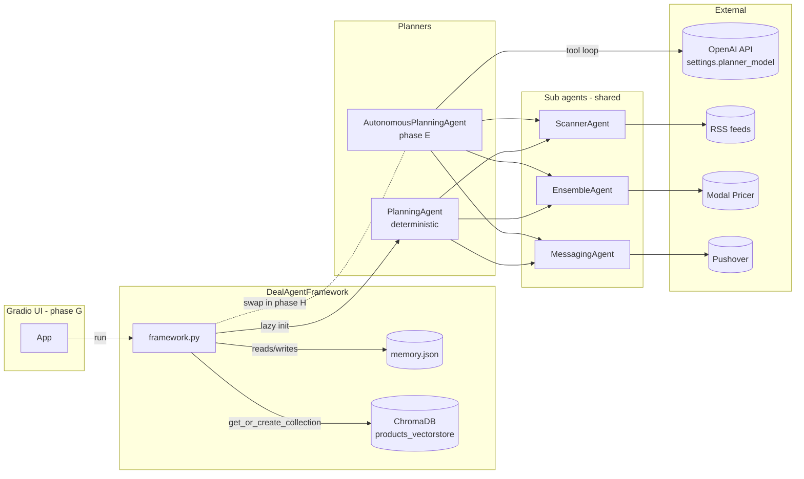
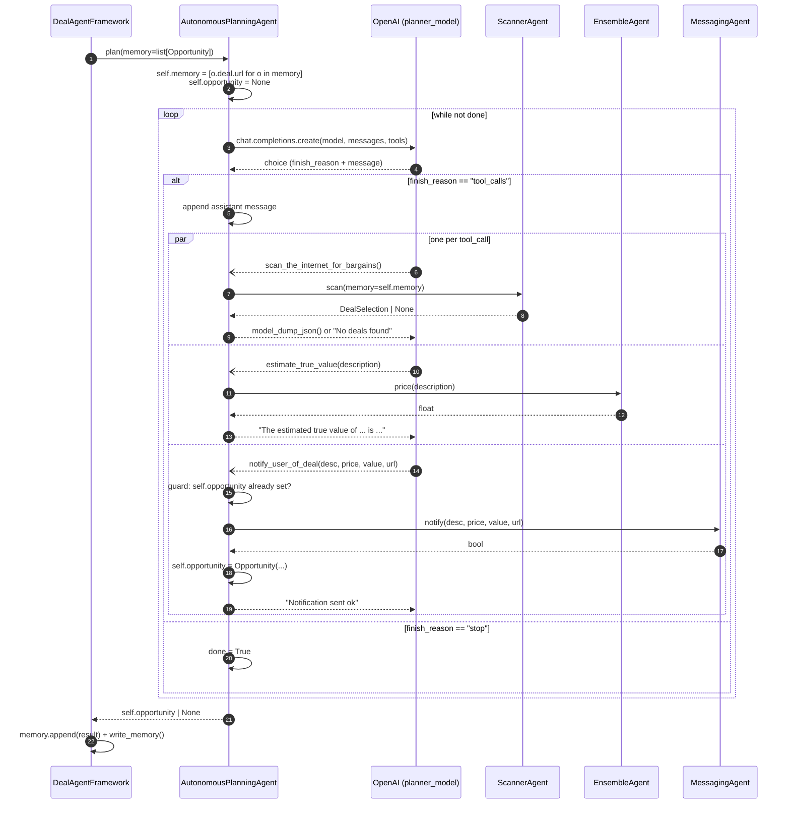
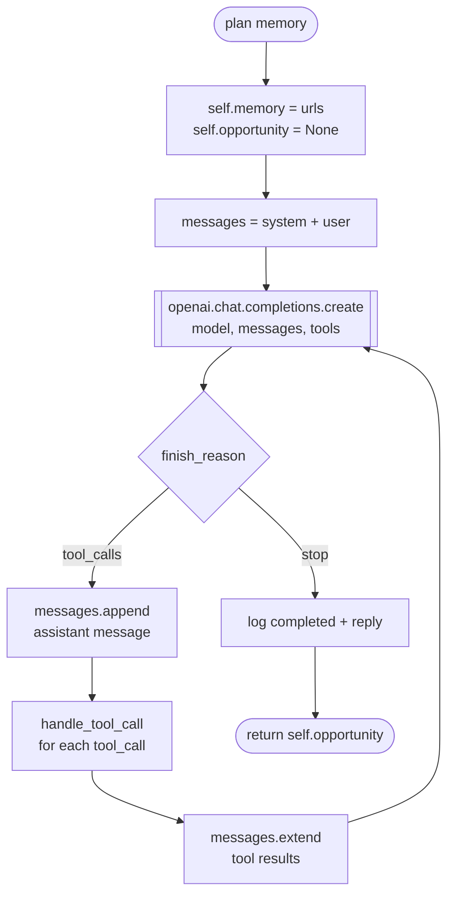
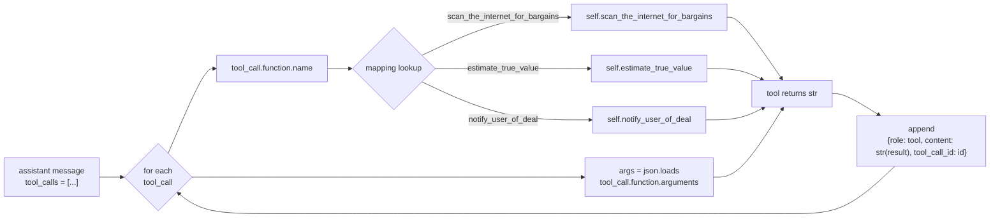
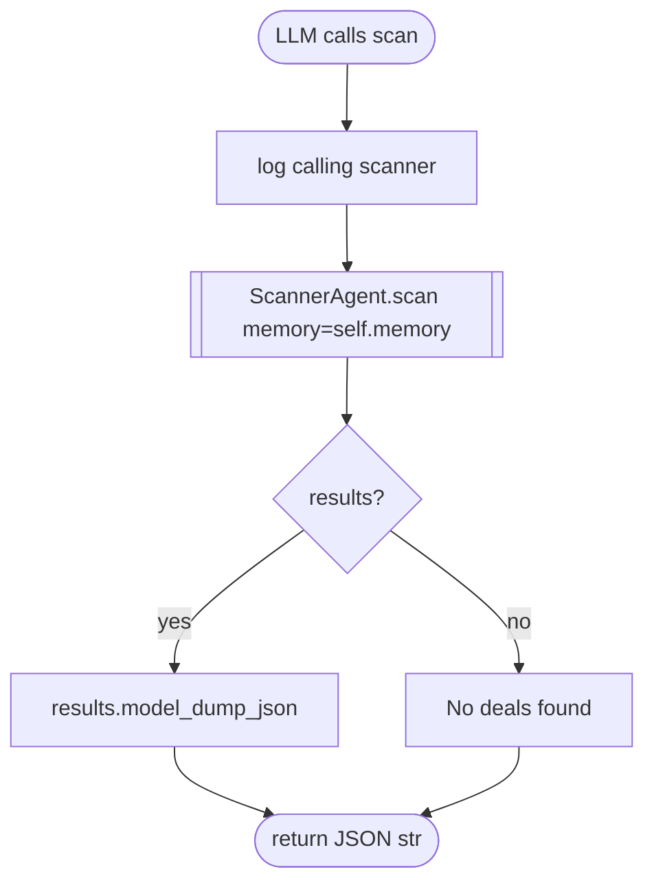
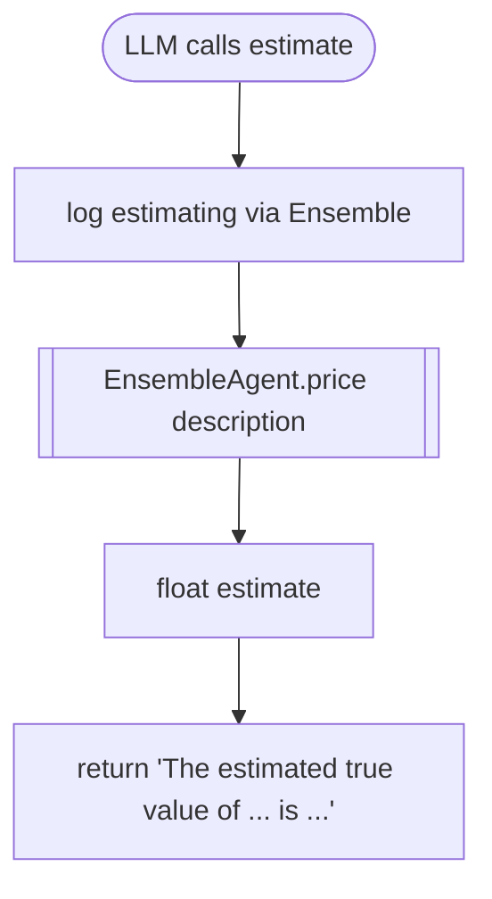
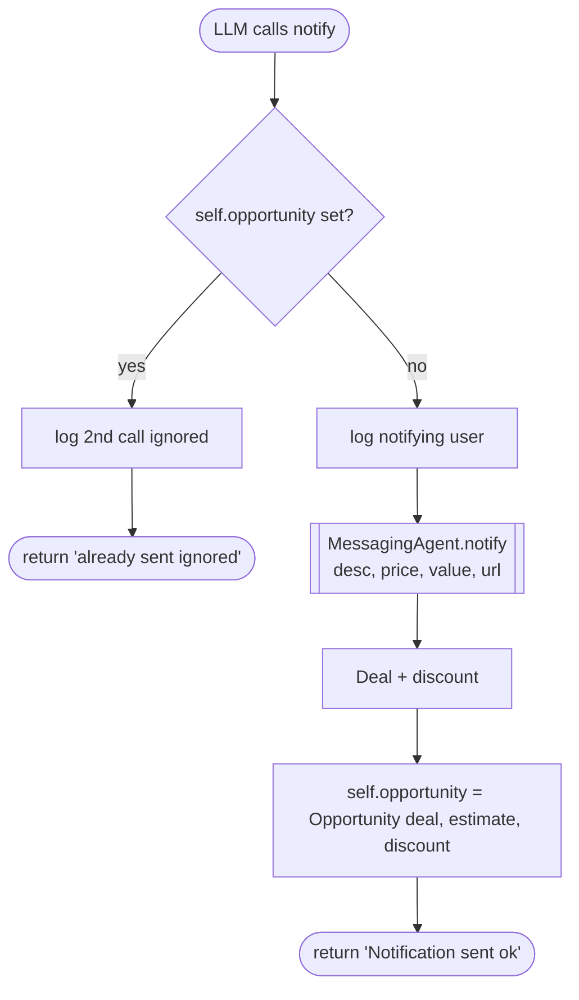
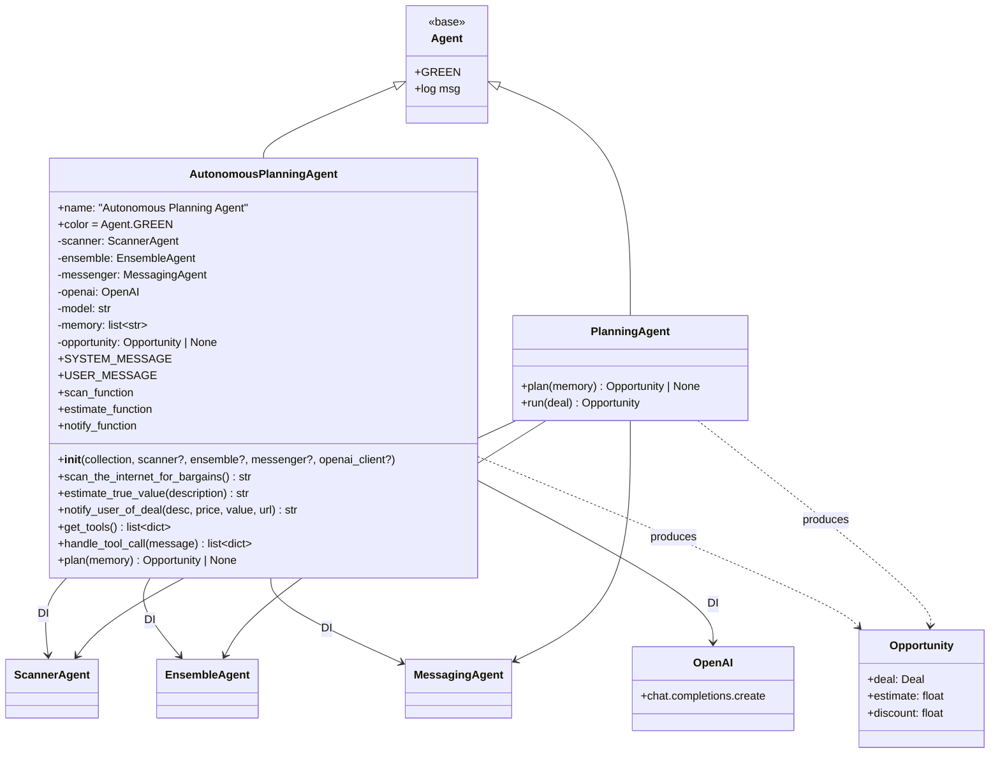
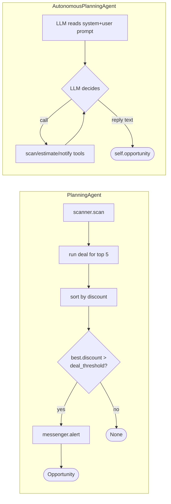
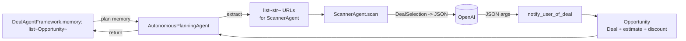

# `AutonomousPlanningAgent` — Visual Overview

Companion diagrams for [.cursor/plans/phase_e_beginner_walkthrough_2422ea9e.plan.md](../../.cursor/plans/phase_e_beginner_walkthrough_2422ea9e.plan.md).

The autonomous planner does the same job as the deterministic `PlanningAgent` (scan -> price -> alert) but delegates the ordering to an LLM via OpenAI **tool calling**. This doc shows how the pieces fit.

---

## 1. Landscape — where the autonomous planner sits



---

## 2. Sequence — one `plan()` turn with the LLM driving



---

## 3. The `plan()` control loop (flow view)



---

## 4. Tool dispatch — how strings become Python calls



---

## 5. Per-tool flow

### 5a. `scan_the_internet_for_bargains`



### 5b. `estimate_true_value(description)`



### 5c. `notify_user_of_deal(...)` — with single-notify guard



---

## 6. Tool schemas — the contract the LLM sees

```mermaid
classDiagram
    class scan_function {
        name: scan_the_internet_for_bargains
        description: returns top bargains
        parameters: object with no properties
    }
    class estimate_function {
        name: estimate_true_value
        description: estimate true worth
        parameters.description: string
        required: [description]
    }
    class notify_function {
        name: notify_user_of_deal
        description: send push; only call once
        parameters.description: string
        parameters.deal_price: number
        parameters.estimated_true_value: number
        parameters.url: string
        required: all four
    }

    class ToolWrapper {
        type: function
        function: {...}
    }

    ToolWrapper <|.. scan_function
    ToolWrapper <|.. estimate_function
    ToolWrapper <|.. notify_function
```

---

## 7. Class view — collaborators and inheritance



Both planners share the same public surface — `plan(memory) -> Opportunity | None` — so `DealAgentFramework` can swap them in phase H without changes to `run()`.

---

## 8. Deterministic vs autonomous — side by side



Same inputs, same sub-agents, same output type. The difference: *who* decides the order — your code, or the model.

---

## 9. Types in, types out



Key conversion: `list[Opportunity]` comes in, URLs are extracted internally for the scanner, and exactly one `Opportunity` (or `None`) comes out.

---

## 10. Acceptance checklist mapped to diagrams

| Check | Covered by |
| ----- | ---------- |
| `plan` returns `Opportunity` or `None` | Section 2, 3 |
| Tool dispatch matches schemas | Section 4, 6 |
| Single-notify guard fires on 2nd call | Section 5c |
| DI for scanner / ensemble / messenger / openai | Section 7 |
| Same public surface as `PlanningAgent` | Section 7, 8 |
| Framework can swap planners | Section 1 |
