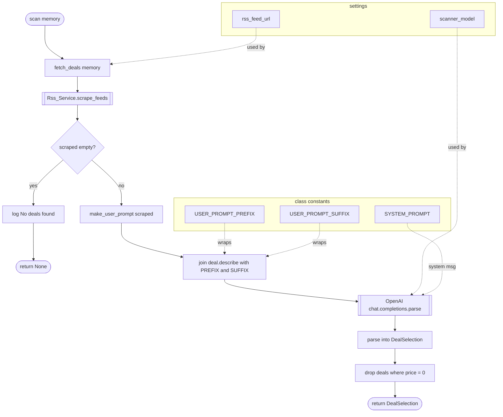
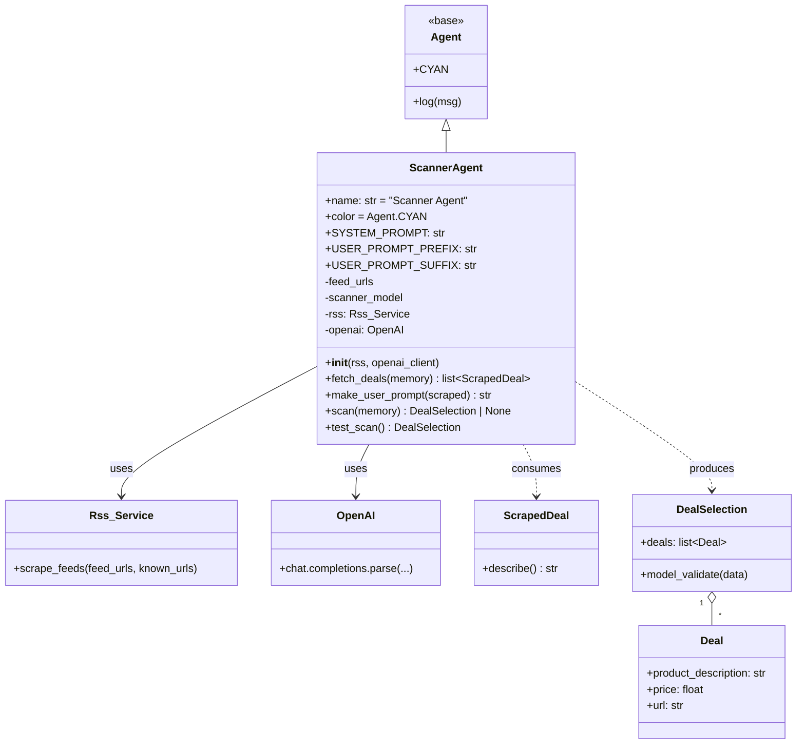

# ScannerAgent — Visual Overview

## 1. Flowchart — `ScannerAgent.scan()` runtime flow

```mermaid
flowchart TD
    Start([scan memory]) --> Fetch[fetch_deals memory]
    Fetch --> RSS[[Rss_Service.scrape_feeds]]
    RSS --> Scraped{scraped empty?}
    Scraped -- yes --> LogNone[log No deals found]
    LogNone --> RetNone([return None])

    Scraped -- no --> MakePrompt[make_user_prompt scraped]
    MakePrompt --> Join[join deal.describe with PREFIX and SUFFIX]
    Join --> Call[[OpenAI chat.completions.parse]]
    Call --> Parse[parse into DealSelection]
    Parse --> Filter[drop deals where price = 0]
    Filter --> Return([return DealSelection])

    subgraph Config [settings]
        FeedUrls[rss_feed_url]
        Model[scanner_model]
    end
    FeedUrls -. used by .-> Fetch
    Model -. used by .-> Call

    subgraph Prompts [class constants]
        Sys[SYSTEM_PROMPT]
        Pref[USER_PROMPT_PREFIX]
        Suf[USER_PROMPT_SUFFIX]
    end
    Sys -. system msg .-> Call
    Pref -. wraps .-> Join
    Suf -. wraps .-> Join
```

---

## 2. Class diagram — static structure and collaborators

```mermaid
classDiagram
    class Agent {
        <<base>>
        +CYAN
        +log(msg)
    }

    class ScannerAgent {
        +name: str = "Scanner Agent"
        +color = Agent.CYAN
        +SYSTEM_PROMPT: str
        +USER_PROMPT_PREFIX: str
        +USER_PROMPT_SUFFIX: str
        -feed_urls
        -scanner_model
        -rss: Rss_Service
        -openai: OpenAI
        +__init__(rss, openai_client)
        +fetch_deals(memory) list~ScrapedDeal~
        +make_user_prompt(scraped) str
        +scan(memory) DealSelection | None
        +test_scan() DealSelection
    }

    class Rss_Service {
        +scrape_feeds(feed_urls, known_urls)
    }

    class OpenAI {
        +chat.completions.parse(...)
    }

    class ScrapedDeal {
        +describe() str
    }

    class DealSelection {
        +deals: list~Deal~
        +model_validate(data)
    }

    class Deal {
        +product_description: str
        +price: float
        +url: str
    }

    Agent <|-- ScannerAgent
    ScannerAgent --> Rss_Service : uses
    ScannerAgent --> OpenAI : uses
    ScannerAgent ..> ScrapedDeal : consumes
    ScannerAgent ..> DealSelection : produces
    DealSelection "1" o-- "*" Deal
```

---

