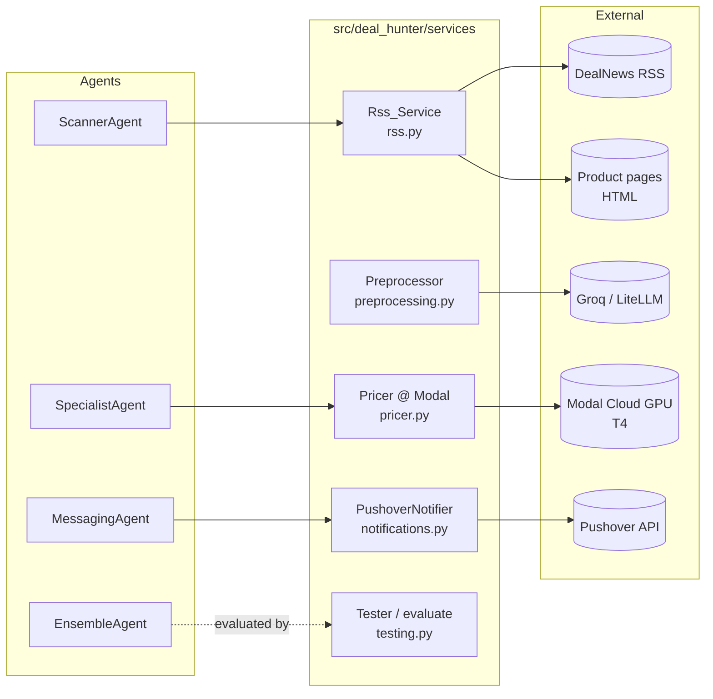
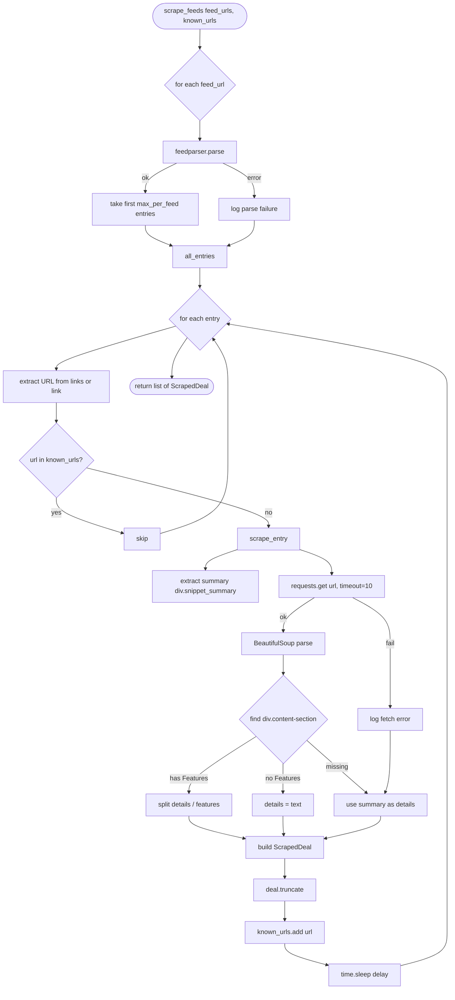
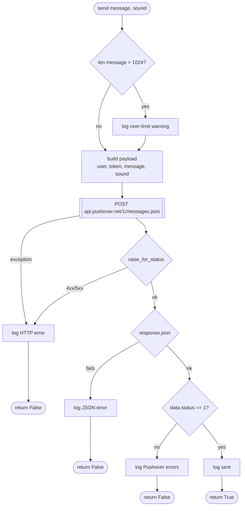
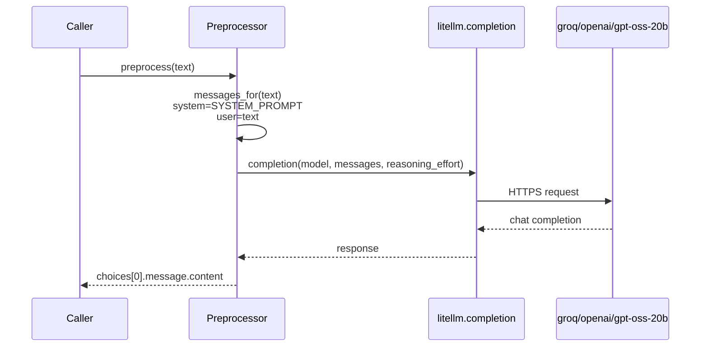
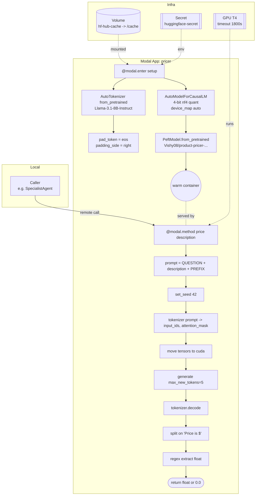
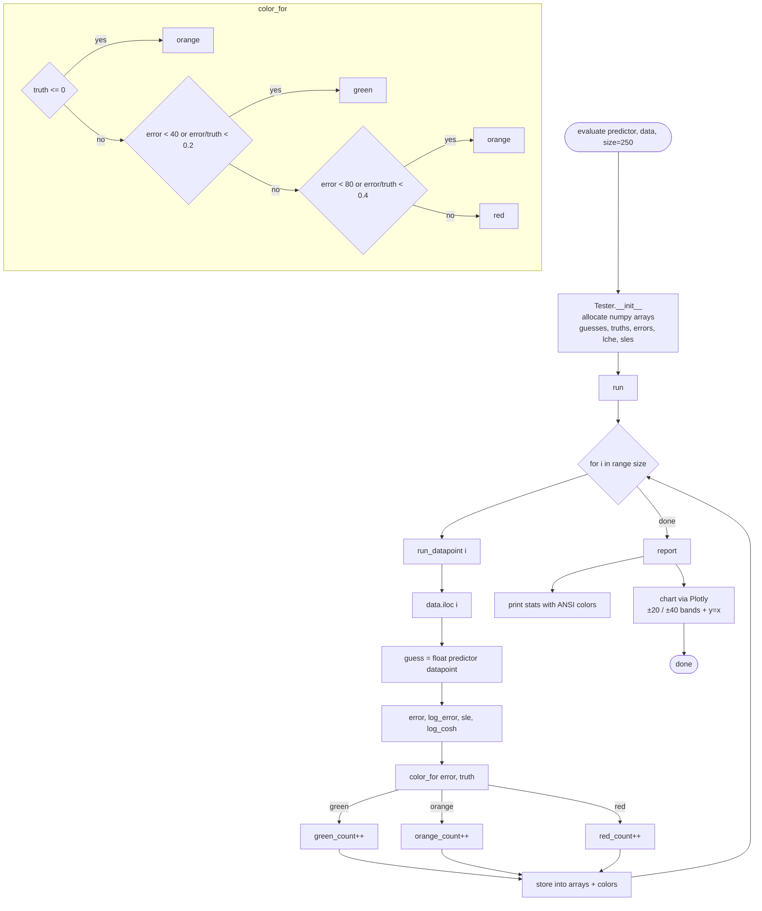
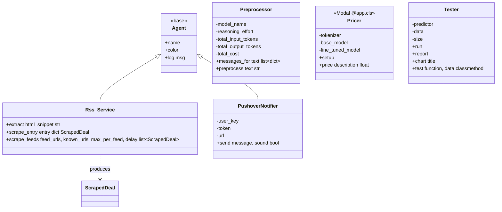

# `deal_hunter.services` — Visual Overview

Five services live under `src/deal_hunter/services/`:

| File                 | Class / API                         | Role                                              |
| -------------------- | ----------------------------------- | ------------------------------------------------- |
| `rss.py`             | `Rss_Service`                       | Pull RSS feeds, scrape product pages into `ScrapedDeal` |
| `notifications.py`   | `PushoverNotifier`                  | Push mobile notifications via Pushover HTTP API   |
| `preprocessing.py`   | `Preprocessor`                      | Rewrite raw product text into a concise LLM-friendly form |
| `pricer.py`          | `Pricer` (Modal `@app.cls`)         | Remote GPU inference with a LoRA-tuned Llama-3.1-8B |
| `testing.py`         | `Tester` / `evaluate()`             | Offline evaluation of any price predictor, with Plotly chart |

---

## 1. Landscape — how services relate to the rest of the system

---

## 2. `Rss_Service` — feed fan-in and page scrape

---

## 3. `PushoverNotifier` — notification send path

---

## 4. `Preprocessor` — LLM rewrite via LiteLLM

Fields tracked per instance: `total_input_tokens`, `total_output_tokens`, `total_cost` (scaffolded, not yet populated by `preprocess`).

---

## 5. `Pricer` — Modal-hosted LoRA inference

Key production detail: `min_containers=0` means cold starts are possible. The `@modal.enter` hook pays the model-load cost once per container, then `price()` is fast.

---

## 6. `Tester` / `evaluate` — offline eval loop

Guardrail in `__init__`: if the caller passes `(DataFrame, callable)` by mistake, the args are swapped with a `UserWarning`.

---

## 7. Class view — inheritance and boundaries

`Preprocessor`, `Pricer`, and `Tester` deliberately do **not** inherit from `Agent` — they are infrastructure, not agents in the messaging sense. `Rss_Service` and `PushoverNotifier` do inherit from `Agent` only to reuse the colored `log()` helper.
